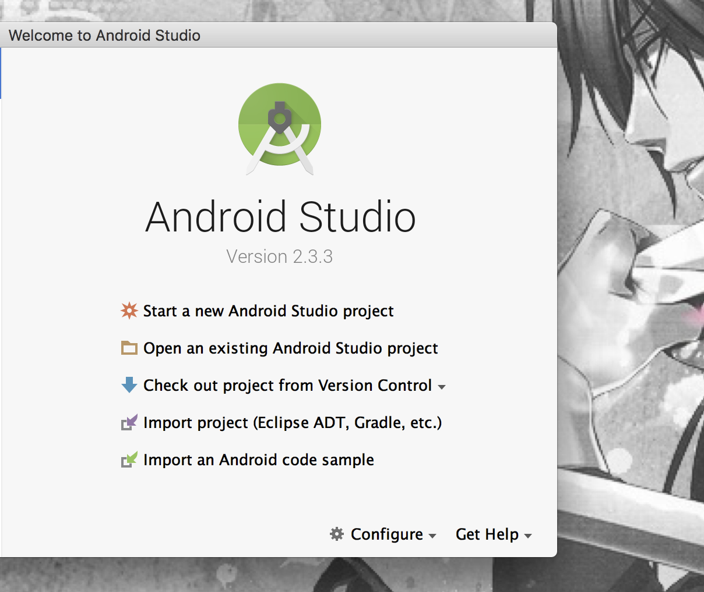

**Android的相关文件需要从谷歌下载，确认开启翻墙**

# 下载java JDK

http://www.oracle.com/technetwork/java/javase/downloads/jdk8-downloads-2133151.html  
下载Mac OS X版本，下载完后按提示步骤安装  
在终端上用 **java -version** 查看安装的版本信息
  
# 下载Android Studio  

https://developer.android.com/studio/index.html  

