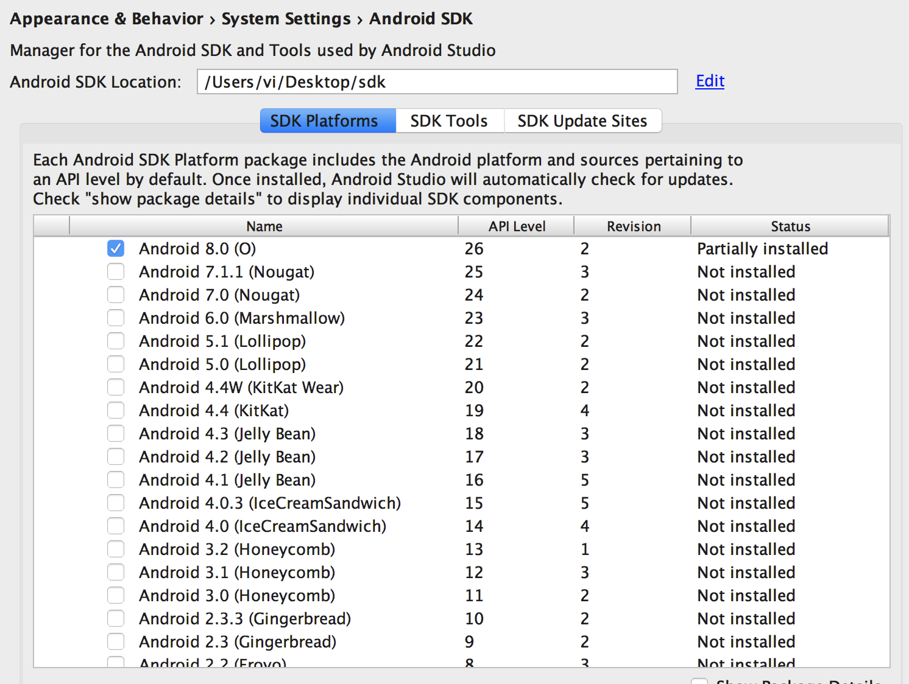
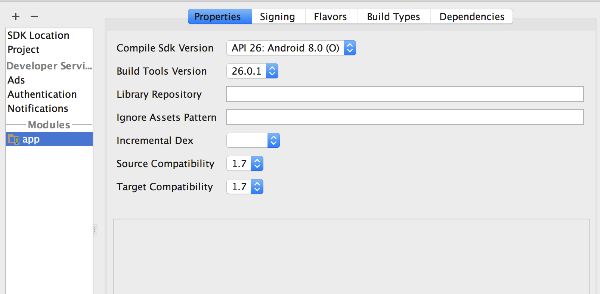
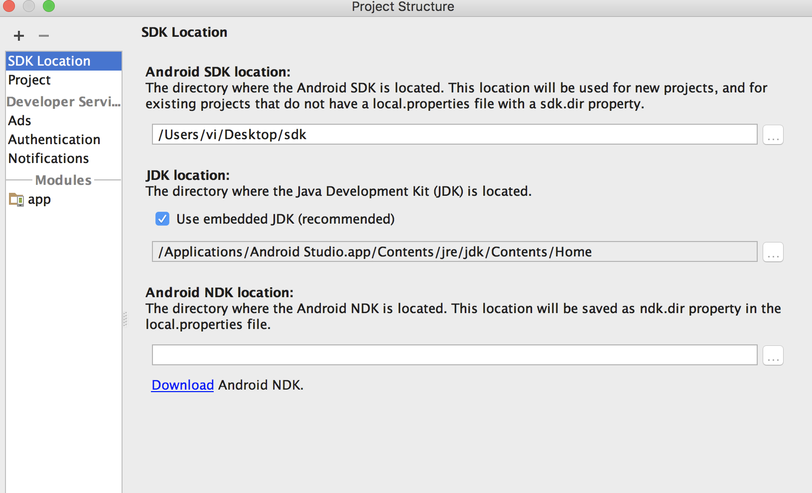
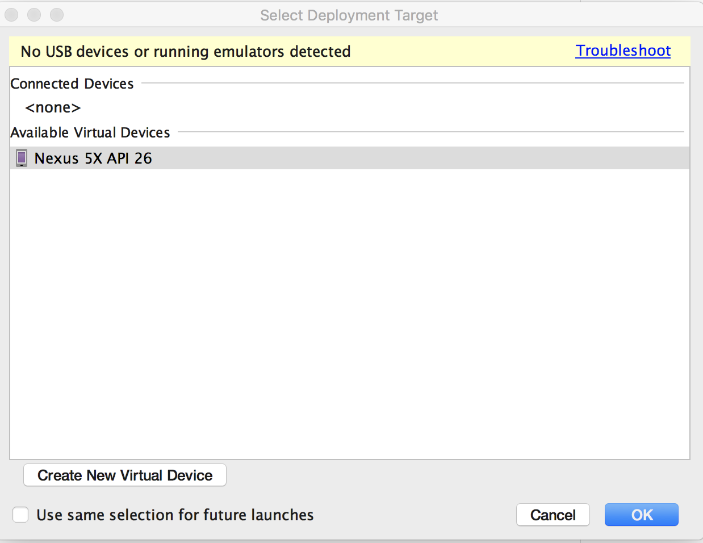
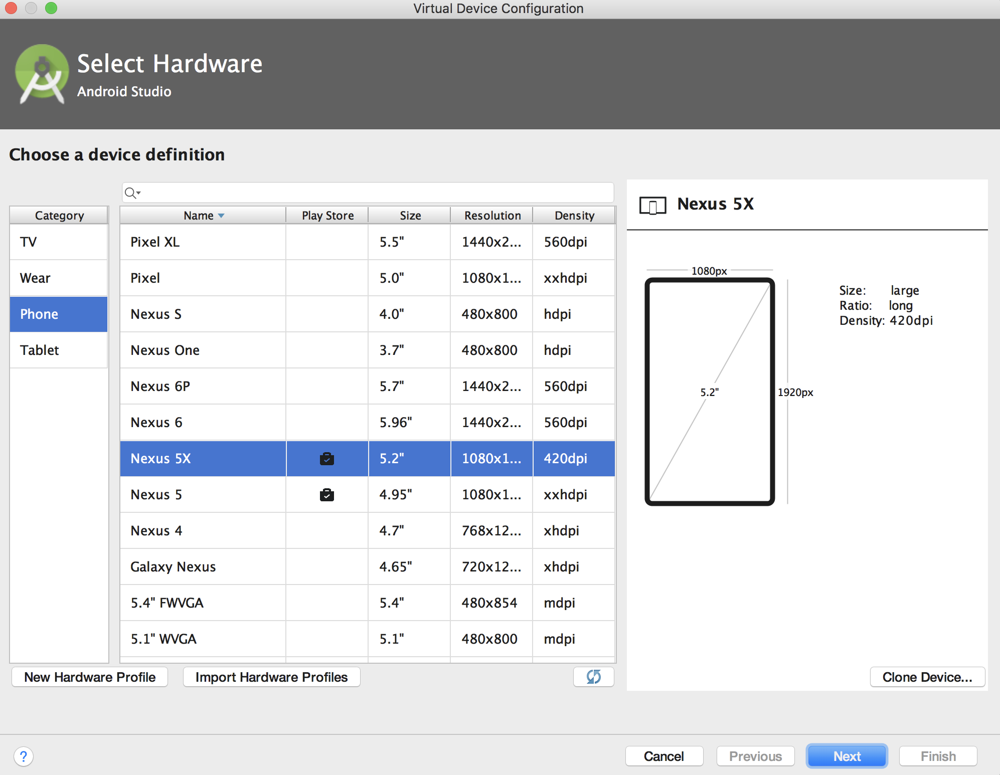
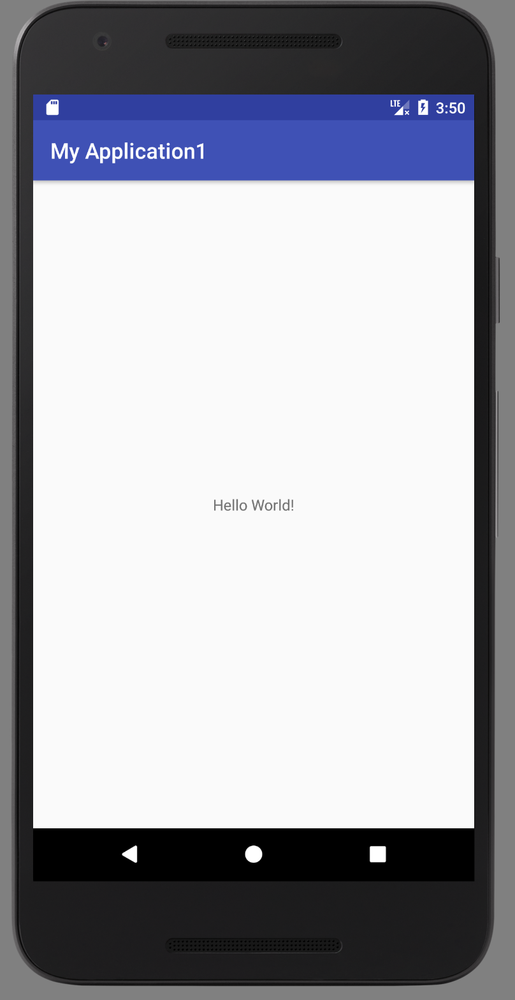
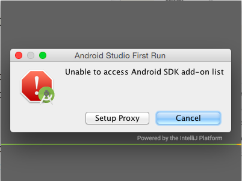

**Android的相关文件需要从谷歌下载，确认开启翻墙**

# 下载java JDK

http://www.oracle.com/technetwork/java/javase/downloads/jdk8-downloads-2133151.html  
下载Mac OS X版本，下载完后按提示步骤安装  
在终端上用 **java -version** 查看安装的版本信息
  
# 下载Android Studio  

https://developer.android.com/studio/index.html  
  
安装完成后打开，进入欢迎页，选择是否加载以前配置，默认第一次使用，不加载  

  
# 配置SDK
  
欢迎页点击next
在Android SDK location中填写SDK的安装目录（自己新建目录，用来储存将要下载的SDK）  
  
选择需要的SDK版本，点击next下载(从谷歌翻墙下载，速度较慢，也可手动下载)  
安装完毕后回到首页，右下角的设置项，选择SDK Manager进行SDK的版本和工具管理  
编辑正确的SDK文件夹路径  
  

# 新建项目
  
首页  **Start a new Android Studio project**  
在第一页填写自己的项目信息，其余项都可保留默认值  
项目创建后，在 **file->Project Structure** 中可以对该项目所用的SDK版本进行配置  
  
  
  
在项目没有错误的情况下，点击工具栏中绿色的箭头运行该项目  
首次运行需要安装模拟器（依然翻墙）  
安装完毕后选择相应的模拟器版本即可运行该项目  
  
点击左下角可以新建其他版本的模拟器  
  
此时应该在模拟器屏幕上显示 **Hello world** 字样  
 

# 可能出现错误

在Studio首次运行时，可能会报错Unable to access Android SDK add on list  

点击cancel  
1）进入应用程序，找到Android Studio，右键->显示包内容->Contents->bin，找到文件idea.properties，使用文本工具打开  
2）在idea.properties文件末尾添加一行：disable.android.first.run=true，然后保存文件。  
3）关闭Android Studio后重新启动，便可进入界面。
